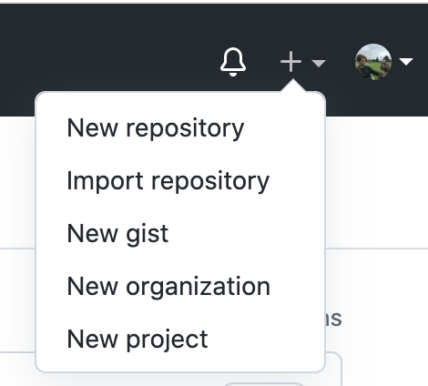

# Getting started with git and github
This tutorial assumes that git has already been installed and the user has created an account on github. 

### 1. Create a repository on github.com
- in the upper right hand corner of the screen, click the + and 'New repository'

- Choose a simple name for your repository (e.g. starting-github-tutorial)
- Select the option to add a README file

### 2. Open the terminal
- On a mac, type 'terminal' in spotlight (or iTerm2 if you prefer)
- On windows...use your preferred bash terminal. [Here is a site](https://www.computerhope.com/issues/ch001927.htm) that was updated relatively recently (June 2020) that includes instructions for getting started with git on windows. 

### 3. Check git:
`git --version`

### 4. Check your configuration variables
- If you already have git installed from a while ago, you can check your config variables to see if you already have some:  

`git config --list`

### 5. Set up configuration variables  

`git config --global user.name "YOUR NAME HERE"`  

`git config --global user.email "YOUR EMAIL HERE"`

### 6. Navigate to the folder you would like to be working in  

`cd berkeley/tutorials`

### 7. Initiate an empty local git repository  
Return to your command line (in the same working directory as you were before)
`git init`

### 8. Connect your local folder location to a remote repository on github
- Go to github.com, sign in
- navigate into the repository you've created for this project, and at the top right of the screen, click the green 'Code' button. 
- Copy the https URL, and return to the terminal:  

`git remote add origin [paste URL here]`

### 9. Pull changes from github
- Since you created the README file on github, you want to bring that to your local directory.
`git pull origin main`  

### 10. Create an empty test file in your local directory  
   
`touch test.txt`  

- type `ls` in your command line, and you should see this file appear. 

### 11. Submit local changes to git
`git add .`  

### 12. Check to see whether changes have been incorporated
`git status`  

### 13. Write a commit message: describe the changes you made
`git commit -m "first commit"`  

### 14. Push changes to your remote repository on github  

`git push -u origin main`  
- NOTE: you only have to use the `-u` flag for the FIRST push. Later, you can just write `git push origin main.`  
- check github.com - you should now see your empty test.txt file appear in your online github repository!  

### 15. Create a .gitignore file using the command line
- This is where you can specify which files/folders that you DON'T want sent to github from your local workspace.  

`touch .gitignore`  

`vi .gitignore`  

- press 'i' for insert, and write `test.txt` on the first line. We are going to see what happens when we add this to .gitignore and push changes to github.
	- if you wanted to add a folder, it should be written like this: `folder-i-dont-want-on-github/`
- press `<ESCAPE>` to get out of write mode onec you are finished
- `:wq` and then `<ENTER>` will quit and save changes.  

### 16. add, commit, and push changes to github  
`git add .`  
`git commit -m "adding .gitignore file"`  
`git push origin main`   
- note that this time, we don't need to add the -u flag.
- Check your repository on github: the test.txt file should no longer appear, and your .gitignore file should be there.

#### That's it! You did it!

## Troubleshooting and other useful commands for when mistakes are made...
### To remove a remote repository from your local working directory:
`git remote rm [name of remote]`  

### To un-add changes to git from the local repository & start over
`git reset`

### to get rid of an empty git repo in your local working directory
`rm -rf .git`

### to get rid of newly created test files that you don't want
`rm test.txt test2.txt`