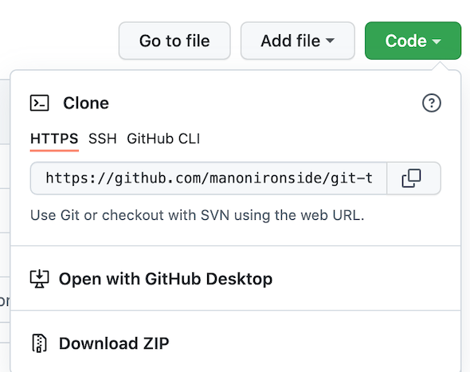
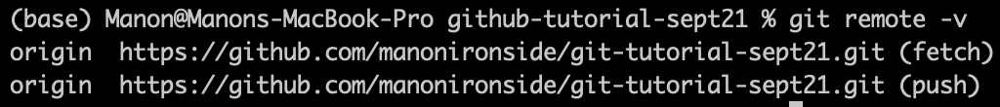

# Getting started with git and github
This tutorial assumes that git has already been installed and the user has created an account on github. 

### 1. Create a repository on github.com
- in the upper right hand corner of the screen, click the + and 'New repository'

- Choose a simple name for your repository (e.g. starting-github-tutorial)
- Select the option to add a README file

### 2. Open the terminal
- On a mac, type 'terminal' in spotlight (or iTerm2 if you prefer)
- On windows...use your preferred bash terminal. [Here is a site](https://www.computerhope.com/issues/ch001927.htm) that was updated relatively recently (June 2020) that includes instructions for getting started with git on windows. 

### 3. Check git:
`git --version`

### 4. Check your configuration variables
- If you already have git installed from a while ago, you can check your config variables to see if you already have some:  

`git config --list`

### 5. Set up configuration variables  

`git config --global user.name "YOUR NAME HERE"`  

`git config --global user.email "YOUR EMAIL HERE"`

### 6. Navigate to the folder you would like to be working in  

`cd berkeley/tutorials`

### 7. Copy the remote repository to your local working space  
- Go into your repository on github.com, and click the green 'code' button on the upper right of the screen. Copy and paste the HTTPS web URL:  
  

In your terminal, run the following command:  

`git clone [paste URL here]`  

- Check your current directory - you should see a new folder show up with the github project name!  

`ls`

- Move into that folder:  
`cd [name of github repo]`  
`ls`  

- You should now see the readme file show up in your local directory!  

- You can also check to see that git is connected to the remote repository on github:  
`git remote -v`  
- You should see something like this:  
  

### 8. Create an empty test file in your local directory  
   
`touch test.txt`  

- type `ls` in your command line, and you should see these files appear. 

### 9. Submit local changes to git
`git add .`  

### 10. Check to see whether changes have been incorporated
`git status`  

### 11. Write a commit message: describe the changes you made
`git commit -m "first commit"`  

### 12. Push changes to your remote repository on github  

`git push -u origin main`  
- NOTE: you only have to use the `-u` flag for the FIRST push. Later, you can just write `git push origin main.`  
- check github.com - you should now see your empty test.txt file appear in your online github repository!  

### 13. Create a .gitignore file using the command line
- This is where you can specify which files/folders that you DON'T want sent to github from your local workspace.  
- Start by creating another file - we will add it to .gitignore.

`touch another-test.txt`  
`ls`  

- Create a .gitignore file, and open it in Vi from the command line to edit. 
`touch .gitignore`  

`vi .gitignore`  

- press 'i' for insert, and write `another-test.txt` on the first line. We are going to see what happens when we add this to .gitignore and push changes to github.
	- if you wanted to add a folder, it should be written like this: `folder-i-dont-want-on-github/`
- press `<ESCAPE>` to get out of write mode once you are finished
- `:wq` and then `<ENTER>` will quit and save changes.  

### 14. add, commit, and push changes to github  

`git add .`  
`git commit -m "adding another-test.txt file"`  
`git push origin main`   
- note that this time, we don't need to add the -u flag.
- Check your repository on github: the another-test.txt file should *not* appear, and your .gitignore file should be there.

#### That's it! You did it!

## Troubleshooting...
### To remove a remote repository from your local working directory:
`git remote rm [name of remote]`  

### To un-add changes to git from the local repository & start over
`git reset`

### to get rid of an empty git repo in your local working directory
`rm -rf .git`

### to get rid of newly created test files that you don't want
`rm test.txt test2.txt`

## Other useful commands
- In this tutorial, we used `git clone` to download the repository from github onto our local drive. This does multiple things at once: in addition to downloading the repository, it automatically initiates a local git repository, and connects your local working directory with the remote repository. This works great in some cases, but there might be a case in which changes are made online in an existing repository and you want to update those changes locally, or perhaps you want to get started locally. 

If you want to get started locally, your workflow might look like: 

`cd berkeley/tutorials` (navigate to where you want to work from locally)   
`git init` (to open an empty git repository in your local working directory)  
`git remote add origin [paste URL here]` (to connect your local directory with an online github repository. Use the same URL as you would use for `git clone`).  

If you are working on an ongoing project, and you (or a collaborator) makes changes to an online repository, you'll want to update your local directory before making more changes. To do this, you can run:  

`git pull origin main`  

to merge online changes to your local directory.   
